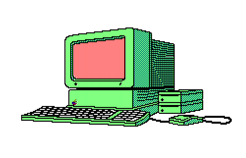
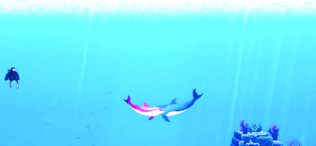

<h1 align="left">👋 Hey there! Welcome to my profile!</h1>

  

> *"Building robust, scalable software through Clean Architecture and continuous learning."*

 

<h1 align="left">🏆 Featured Work & Core Stack</h1>
| Project | Architecture & Focus | Applied Tech |
| :--- | :--- | :--- |
| 👥 **[ReferralSystem](https://github.com/garc1a04/ReferralSystem)** | **Full-Stack Architecture:** Scalable referral tracking system managing user relationships, custom link generation, and business logic. |  |
| 🧬 **[API-POKEDEX](https://github.com/garc1a04/Pokedex-Unifor)** | **AI & Microservices:** Orchestration of custom convolutional neural networks for image recognition and classification. |  |
| 🖼️ **[Image Processing API](#)** | **Cloud Security & Performance:** High-performance file transformations using Sharp, MinIO integration, and secure presigned URLs. |  |
| 📖 **[IndiceRemissivo](https://github.com/garc1a04/IndiceRemissivo)** | **Data Structures & Algorithms:** Efficient text parsing engine utilizing complex data structures for fast, automated cross-referencing. |  |
| 🔍 **[Github-User-Code](https://github.com/garc1a04/Github-User-Code)** | **API Integration:** Responsive client-side application consuming the GitHub REST API to fetch and render developer data dynamically. |  |

 

### 👨‍💻 About Me
I'm **Guilherme Garcia Monteiro**, a 7th-semester Computer Engineering student at Unifor and a Full-Stack Developer Intern at Vortex 🇧🇷. 
I am deeply passionate about **Competitive Programming**, solving complex problems, and creating meaningful projects. My experience ranges from crafting high-performance REST APIs to exploring artificial intelligence and modern software architecture.

### 🚀 Current Focus
- 🏗️ Designing and building **REST APIs** and microservices with **TypeScript/NestJS**, **Java/Spring Boot**, and **Clojure**
- 🧠 Studying **Artificial Intelligence & Machine Learning**, including neural networks, pattern recognition, and custom classifiers
---

## 🤝 Let's Connect!

I'm always open to discussing backend architecture, machine learning, or game development. Feel free to reach out!

  
  
  
  

---

## 📈 GitHub Activity

  
  
  

---

  
  
<i>Thanks for dropping by! See you in the code. 👾</i>

